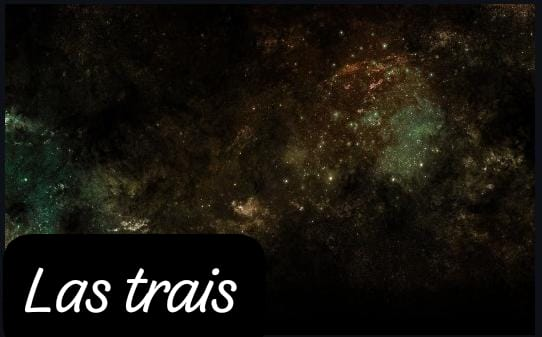

LAS TRAIS

El proyecto esta desarrollado sobre MinGW64 utilizando Msys2 y como editor se esta utilizando Visual Studio Code

es un divertido juego sobre el espacio, tu eres el general que maneja una nave por el universo desrullendo meteoritos que se acercan a ti con intenciones de destruirte

Programas necesarios
Visual estudio code
Descargar e instalar vscode en el siguiente Enlace.

MSYS2 (Windows)
Instalar Msys2 usando el siguiente Enlace.

No modificar ningua opcion al momento de intalacion o podrian variar las configuraciones.

Una vez instalado es necesario agregar los siguientes directorios al path de windows y reiniciar.

C:\msys64\mingw64\bin

C:\msys64\usr\bin

Github Desktop
Cliente de escritorio para clonar el repositorio, descargar usando el siguiente 
https://desktop.github.com/

Git
Para poder realizar commits de vscode es necesario tener instalado Git, descargarlo del siguiente 
https://git-scm.com/

Librerias utilizadas (Msys2)
Ejecutar los siguientes comandos en la terminal de msys2 para instalar las dependencias necesarias

DevTools
Compiladores y herramientas necesarias para el desarrollo.

https://code.visualstudio.com/docs/cpp/config-mingw

pacman -S --needed base-devel mingw-w64-x86_64-toolchain

SFML
https://packages.msys2.org/package/mingw-w64-x86_64-sfml

pacman -S mingw-w64-x86_64-sfml

Box2D simulaciones de fisica - C++
https://box2d.org/documentation/ https://packages.msys2.org/package/mingw-w64-x86_64-box2d?repo=mingw64 pacman -S mingw-w64-x86_64-box2d

Complementos necesarios VSCode
Material Icon
C/C++
PlantUML
GitGraph

BY
- Emmanuel Robles Santos-22310167
- Hector Emmanuel Chavez Barragan-22310203
